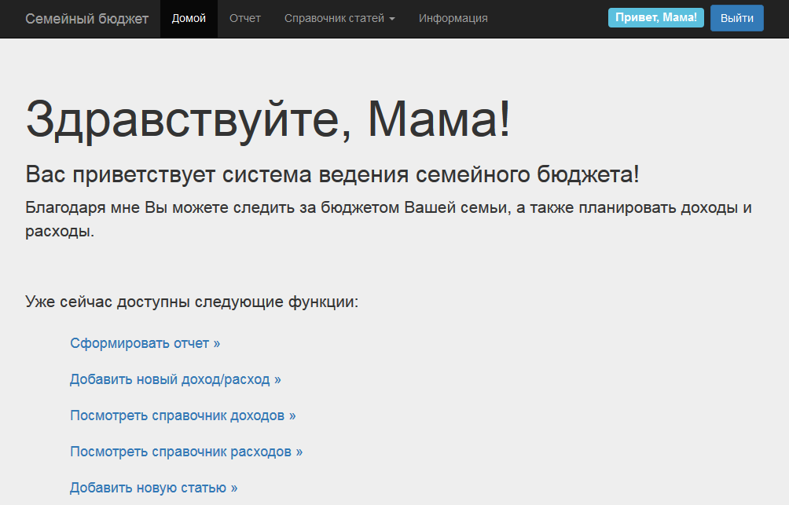

# household_budget

This simple project is based on [Django framework](https://www.djangoproject.com/) and is used to manage and planning budget of a family. It demonstrates some features of the framework such as authorization function, store data in DB, asynchronous requests with jQuery, dynamic forms with Bootstrap CSS and etc.



Web interface of the project has been translated only to Russian.

Russian description of it available in [README.txt](README.txt).  

## Getting Started

### Configure database access

The project uses MySQL database. Tests and deployment it will become easy with [PythonAnywhere](https://pythonanywhere.com) service. 
View [official](https://help.pythonanywhere.com/pages/) docs about these processes for addition information.
If you want to use your local DB instance or SQLite database, you should find in [settings.py](household_budget/settings.py) file next strings:

```
DATABASES = {
    'default': {
        'ENGINE': 'django.db.backends.mysql',
        'NAME': 'GRomR1$household_budget',
        'USER': 'GRomR1',
        'PASSWORD': 'passw0rd',
        'HOST': 'GRomR1.mysql.pythonanywhere-services.com'
    }
}
```

Edit this to correct config data about your host, username and etc. Or use SQLite:

```
DATABASES = {
    'default': {
        'ENGINE': 'django.db.backends.sqlite3',
        'NAME': os.path.join(BASE_DIR, 'db.sqlite3'),
    }
}
```

## How do I run this project locally?

### 1. Clone the repository:

    git clone https://github.com/GRomR1/household_budget.git

### 2. Run migrations:

    python manage.py migrate

### 3. Create a user:

    python manage.py createsuperuser

### 4. Run the server:

    python manage.py runserver

### 5. And open [127.0.0.1:8000](http://127.0.0.1:8000) in your web browser.

## License

This project is licensed under the MIT License - see the [LICENSE.md](LICENSE.md) file for details